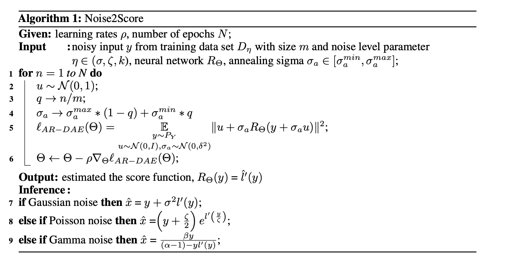
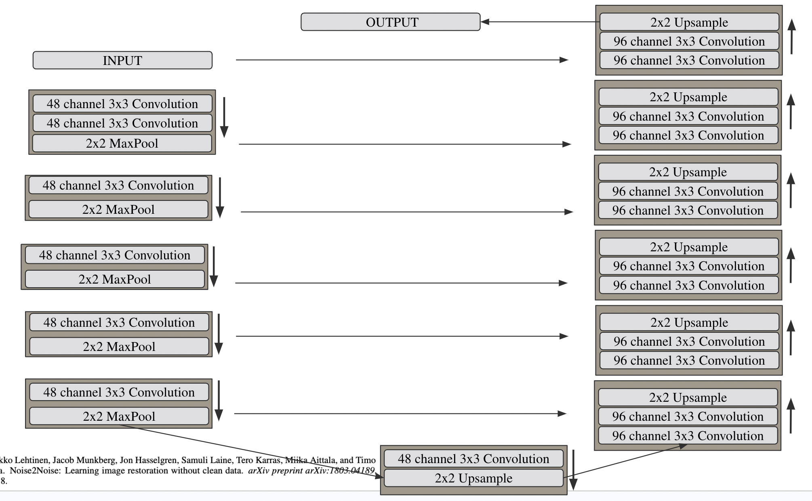
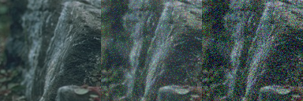
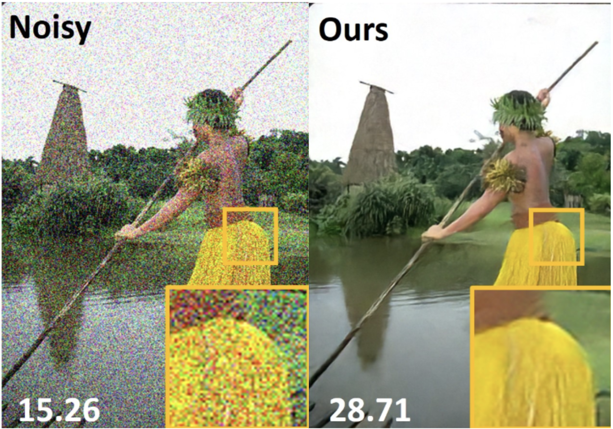
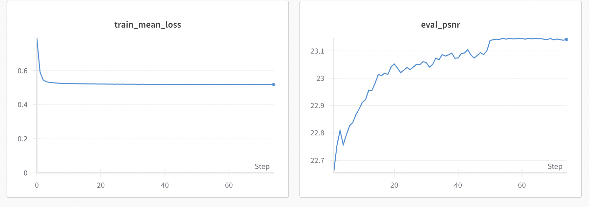

# Noise2Score-Reproduce

## Introduction 

Originally submitted to NeurIPS 2021 conference by Kwanyoung Kim and Jong Chul Ye, "Noise2Score: Tweedie’s Approach to Self-Supervised Image
Denoising without Clean Images" was published with the goal of unifying previouse image-denoising neural network architectures that don't rely on clean training data. 

The method relies on a U-Net Architecture that learns an encoding map of the noisy images to a score function $l'(y)$ that is trained with respect to an AR-DAE Loss(amortized residual denoising autoencoder). The DAE and AR-DAE loss had both previously been shown to be used for score-function learning but around the time the paper came out, AR-DAE had shown to be a more stable loss function to train with. It should be noted that the training stage is not at all reliant on the level of how denoised the image is after processing this score. After learning the score function, the model retrieves the final denoised image by deterministically calculating the expected original values of the unoised image pixels using Tweedie's Formula for exponential probability distributions(which each correspond to their own exponential noise).

The use of Tweedie's Formula is the biggest contribution from the paper and what differentiates it from previous models such as Noise2Noise and Noise2Void. It does not simply reconstruct a clean image with a neural network but rather learns a key piece of information about the noise, its score, which the model then feeds into a deterministic equation to return the denoised image as an expected center value for the exponential probability distribution associated with the noise type of the image. 

Such a result is significant for multiple reasons, the most direct of which is that Kwanyoung and Jong Chul found that this model outperformed previous denoising models they benchmarked with across all noise types when the noise parameter level was known. But, the success of using Tweedie's formula also presents an explicit quantity in mathematics for what the neural network is trying to learn, which creates a generally more interpretable model than one that only reconstructs the image. The paper has been cited by some articles and papers that seeked to continue improving denoising technology and has specifically been cited in many works in Score Based Diffusion Model developement.

## Chosen Result 

The results we have chosen to reimplement can be found in Table 2 of the original paper, specifically the evaluation PSNR scores they were able to achieve with gaussian noise at a signal of $\sigma =25$ with known parameters under the 3 evaluation datasets listed below. It's reccomended to view the original paper but a paraphrasing of the portion of the table that we aim to reproduce has been include below with which data sets we decided to evaluate against.

| Dataset | PSNR Value | 
| ------- | --------- |
| CBSD68  | 30.85    |
| Kodak   | 31.89    |
| Set12   | 30.13    |

These result gives a quantitative benchmark for how Noise2Score outperforms
other methods with known parameters, but isn’t as performant as N2N and Supervised Learning
with unknown parameters. However, the Noise2Noise and Supervised Learning method is explained
to be impractical in the original paper. Thus this result claims that the Noise2Score method is the highest-performing
method within a reasonable scope. The result then shows the practicality of using Noise2Score for state of the art image denoising. 

## Re-Implementation Details

### Algorithm: 

We replicated the pseudo code provded by the original Noise2Score paper. 

### Model Implementation 
 

Since this paper did not provide specific details or modifications they made, we adopted the model architecture provided in the Noise2Noise paper, which is referenced from the original Noise2Score paper. 

The model includes 4 desampling encoder blocks and 5 upsampling decoder blocks, with output from each encoder concatenated to the input of any decoder block. 

As specified by the paper in the appendix, we used an Adam optimizer and a StepLR scheduler that steps the learning rate from 0.0002 to 0.00002 every 50 epochs. 

### Training and Evaluation Data 
- Training Dataset: DIV2K high resolution training data 
- Validation Dataset: DIV2K high resolution validation data set 
- Testing Dataset: CBSD68 dataset, Kodak dataset, and Set12 Dataset

We process the images with the following pipeline 
1. Select a random 128x128 patch from each image of the dataset 
2. Scale the pixel values from 0-255 to 0-1: This is because we are predicting very small noise values with the sigma annealing during training, thus reducing the input scale could reduce training difficulties
3. Randomly augment images with horizontal and/or vertical flips 
4. Add noise specified the known parameters (Gaussian noise with $\sigma=25$ in our case) to create the pair of clean vs. noised images 

### Evaluation Metric: PSNR 

Peak Signal to Nois Ratio (PSNR) defines a nosie measuring metric that increases as noise between two images decreases. We evaluate our model by evaluating the reconstructed image with the clean, un-noised image using this ratio. 

$$
    PSNR = 10 \log_{10}(\frac{R^2}{MSE})
$$

Where MSE denotes the mean squared difference across the two denoised and clean image pixels, and $R$ being the maximum possible value of each of the pixel channels ( 1 if scaled down, 255 if the original RGB image). 

### Modifications to the paper method 

We tried to reproduce the paper's method and architecture as much as possible. However, directly training with the RGB image under a scale of 0-255, and this is because we saw extremely slow and unstable model improvements with the images scaled 0-255. Therefore, we scaled our images to 0-1. 

Additionally, we trained our model only using the DIV2K dataset as opposed to the DIV2K + CBSD400 datasets, and this is because we were unable to find the CBSD400 dataset release online. 

Besides this, we implemented as accurately as we can to the paper's descriptions with an assumption put on the model architecture they used based on the appendix. 

### Instructions to run this repo

#### Installation 
1. Clone the Repository
2. Create the virtual environment: `python -m venv venv`
3. Install dependencies by running: `pip install -r requirements.txt` 

#### Training from scratch
```
cd code
python train.py sing-patch-shuffle.yaml
```

1. Obtain the necessary datasets with instructions provided in the next subsection 
2. Run the following code: 
3. Modify the files in the `conf/` folder to reflect accurate data 
4. Run the following code
```
cd code
python train.py sing-patch-shuffle.yaml
```

#### To Evaluate a Model 
1. Modify the files in the `conf/` folder to reflect accurate data
2. Run the following code
```
cd code
python eval.py --conf_path <path_to_data_configuration> --ckpt_path <path_to_your_model_checkpoint> 
```

#### Computational Resources

This repository trains for about 8-10 hours on a  NVidia GeForce GTX 1080-Ti GPU as mentioned by the paper, and our training experience reflects that statement as well.


#### To Obtain the datasets: 
- DIV2K Training Data: `wget http://data.vision.ee.ethz.ch/cvl/DIV2K/DIV2K_train_HR.zip` 
- DIV2K Validation Data: `wget http://data.vision.ee.ethz.ch/cvl/DIV2K/DIV2K_valid_HR.zip` 
- CBSD68 Dataset: Download from [this](https://github.com/clausmichele/CBSD68-dataset/tree/master/CBSD68/noisy25) repository 
- Kodak Dataset: Download from this [kaggle page](https://www.kaggle.com/datasets/sherylmehta/kodak-dataset)
- Set12 Dataset: Downloaded from [this repository](https://github.com/cszn/DnCNN/tree/master/testsets/Set12)


## Results and Analysis 

Below is a qualitative visualization of the denoising effect from our reimplementation model of Noise2Score. The left is the clean image, the middle is our denoised output, and the right is the fully noised image. It can be seen that there was a denoising effect from the model.


However, when we compare this to the below image that describes the original paper's denoising output example for $\sigma=50$(there was no visualization for $\sigma=25$), we see that their denoising effect is much more clear. 



This also follows in the quantitative results we attempted to recreate, below we see the PSNR values we were able to recreate
. Our results were much lower than the paper's results and the benchmark results recorded by the paper from other denoising models. Despite this, we still observed that our reimplementation was able to achieve an, albeit weaker, denoising effect. 
| Dataset | Mean PSNR Value | 
| ------- | --------- |
| CBSD68  | 23.037    |
| Kodak   | 23.013    |
| Set12   | 22.962    |

We include a training curve for the most successful training run for our model below. It can be seen that our loss converged incredibly fast and didn't continue to improve much over time.



One possible explanation for why our model didn't perform as well is a lower amount of data available. In the paper, they used both Div2K and CBSD400. Div2K and CBSD400 have 800 and 400 images respectively. Without access the CBSD400 dataset, we are working with a significantly smaller training set (66% of theirs). This could factor into why our model didn't improve as much and might point towards why we experienced a quicker convergence.

Another possible explanation is that we made assumptions on the architecture they used as they referenced using the same U-net generator as Noise2Noise. Thus, it's possible they made changes to their U-net that we did not consider, allowing their model to better learn the score function than ours, which we took from the Noise2Noise paper without modification 

While our work didn't yield the quantitative results we hoped for, it was able to show progress in denoising using Tweedie's formula. This shows that the denoising can be done by learning a score function, which is used in a deterministic equation that provides an intepretable way to denoise images, and this equation is explicitly dependent on known statistics and mathematics. In this sense, our reimplementation results reflect the main contribution and goal of the paper and support the proof of concept of using explicit mathematical bases for denoising image reconstruction. Our results also supports the potential use of Tweedie's formula for other tasks that incorporate denoising as part of a larger function such as in Score-Based Diffusion Models.


## Conclusion and Future Work

Our findings showed that while we weren't able to fully reproduce the results of the paper, score-based denoising with Tweedie's formula does having denoising effects that can be qualitatively seen in images that we've applied the trained model on. This showed that the effectiveness of Noise2Noise could be be achievable in a from-scratch reimplementation with more fine-tuning and closer examination of steps and resources the paper may have left out. 

Throughout the process, we learned of the importance of cleanly-documented code with clear configurations and organization when implementing machine learning architectures. We also saw first hand how the scales of the inputs to deep-learning models affect both stability and effectiveness of training as we eventually learned to rescale all our images from their original 0-255 RGB scale to a 0-1 scale that more well-suited the sigma annealing method we implemented.

Future work can go into how well Tweedie's formula performs in more limiting cases, such as when the noise parameter to the images are not known. Some examplesfor such scenarios include having two images noised with gaussian noise of different levels, or perhaps a combination of a Gaussian and Poisson noise signal. 

Another worthwile step to take in the future could be to combine the determinstic outputs of Tweedie's formula with some non-deterministic neural network architecture to see if that would produce even better denoising results. Perhaps feeding forward the expected output of Tweedie's formula with from a learned score will help previous or future models in their denoising models.

## References
[1] K. Kim and J. C. Ye, “Noise2score: Tweedie’s approach to self-supervised image denoising
without clean images,” pp. 864–874, 2021. [Online]. Available: https://proceedings.neurips.cc/
paper_files/paper/2021/file/077b83af57538aa183971a2fe0971ec1-Paper.pdf

[2] J. Lehtinen, J. Munkberg, J. Hasselgren, S. Laine, T. Karras, M. Aittala, and T. Aila, “Noise2noise:
Learning image restoration without clean data,” 2018.

[3] R. Timofte, S. Gu, J. Wu, L. V. Gool, L. Zhang, M.-H. Yang, M. Haris, and et al, “Ntire 2018
challenge on single image super-resolution: Methods and results,” 2018.

[4] E. Kodak, “Kodak lossless true color image suite.”

[5] D. Martin, C. Fowlkes, D. Tal, and J. Malik, “A database of human segmented natural images
and its application to evaluating segmentation algorithms and measuring ecological statistics,”
pp. 416–423, July 2001.

[6] C. Tian, Y. Xu, W. Zuo, B. Du, C.-W. Lin, and D. Zhang, “Designing and training of a dual cnn
for image denoising,” 2020.

[7] J. H. Lim, A. Courville, C. Pal, and C.-W. Huang, “Ar-dae: Towards unbiased neural entropy
gradient estimation,” 2020.
3

